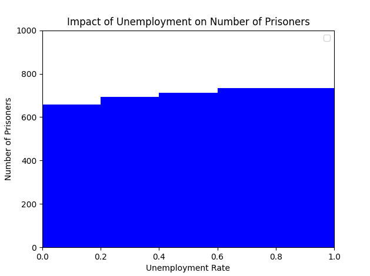
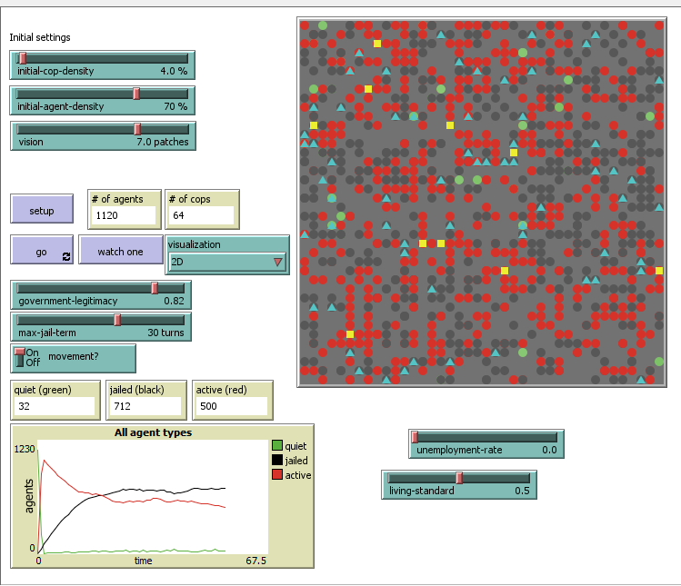

## Комп'ютерні системи імітаційного моделювання
## СПм-22-3, **Марченко Роман Михайлович**
### Домашня робота**. 
Варіант домашньої роботи:
Новий варіант л/р №2.
Внесення змін до будь-якої моделі, яка не була розглянута раніше. Аналог другої лабораторної роботи, але з іншою обраною моделлю.
Максимальна оцінка: 15 балів.

### Модель у середовищі NetLogo: [Rebellion](https://www.netlogoweb.org/launch#https://www.netlogoweb.org/assets/modelslib/Sample%20Models/Social%20Science/Rebellion.nlogo)

### Вербальний опис моделі:

Симуляція "Модель повстання" відтворює ситуацію, де підкорена популяція виступає проти центральної влади. В основі цієї моделі лежить адаптація моделі громадянського насильства Джошуа Епштейна (2002 року).

У моделі присутні дві основні групи акторів: загальна популяція та поліцейські. Популяція блукає випадково і реагує на своє відчуття образи відносно центральної влади та сприйняття ризику повстання. Поліцейські діють в інтересах центральної влади та намагаються придушити повстання. Кожен агент має власний рівень образи та ризику повстання.

Процес взаємодії в моделі включає наступні кроки:

Агенти обчислюють свій індивідуальний ризик повстання на кожному такті на основі внутрішніх параметрів та внутрішнього розрахунку.
Рівень образи та сприйняття ризику впливають на рішення агентів щодо участі в повстанні або спокійному стані.
Поліцейські виявляють активних повсталих агентів та арештовують їх.
Модель дозволяє налаштовувати параметри, такі як щільність поліцейських та загальна щільність популяції, поле видимості агентів та поліцейських, легітимність влади, тривалість ув'язнення та інші. Симуляція допомагає досліджувати динаміку поведінки в умовах конфлікту між популяцією та центральною владою, а також аналізувати стратегії та наслідки повстань та рухів опору.

### Керуючі параметри:
- **initial-cop-density:** Початкова густина поліції у моделі.
- **initial-agent-density:** Початкова густина агентів у моделі.
- **vision:** Видимість (кількість клітинок), яку можуть бачити агенти.
- **government-legitimacy:** Легітимність уряду, виражена у відсотках.
- **max-jail-term:** Максимальний термін ув'язнення для агентів у тактах.

### Внутрішні параметри:

- **k:** Коефіцієнт, що визначає ймовірність арешту.
- **threshold:** Поріг, наскільки G повинен бути вищим за N, щоб спровокувати бунт.
- **risk-aversion:** Ступінь уникнення ризику агента, фіксована на весь час життя, варіюється від 0 до 1.
- **perceived-hardship:** Сприйнята тяжкість агентом, також варіюється від 0 до 1.
- **active?:** Якщо true, то агент активно бунтує.
- **jail-term:** Скільки ходів залишилося в тюрмі? (якщо 0, агент не в тюрмі).
- **neighborhood:** Оточуючі клітинки в радіусі видимості.

### Зміни до коду згідно варіанту
Обов'язкові зміни:

- Доданий новий тип агента: провокатор
- Додана логіка провокатора
- Додані два керуючих параментри: безробіття та рівень життя.

### Обчислювані експеременти
#### Вплив ефекту безробіття на середню кількість увязнених

Дослідити, як зміни в unemployment-rate впливають на кількість ув'язнених, збільшуючи шанси арешту через більшу активність повстанців при високому безробітті.

Параметри моделі:
unemployment-rate: Цей параметр буде варіюватися в експерименті для дослідження його впливу на активність повстанців та кількість арештів

government-legitimacy: 0,82

initial-agent-density: 70%

max-jail-term: 30

initial-cop-density: 4%

vision: 7

living-standart: 0,5

#### Результати:

На основі представлених даних про залежність кількості ув'язнених від рівня безробіття, можна зробити наступні висновки:

Пряма залежність: Існує безпосередній зв'язок між рівнем безробіття та кількістю ув'язнених. Чим вищий рівень безробіття, тим більше людей опиняється за ґратами.

Зростання соціальної напруженості: Високий рівень безробіття може збільшувати соціальну напруженість, що призводить до збільшення кількості учасників повстань та відповідно до зростання арештів.

Економічний драйвер поведінки: Безробіття може бути основним економічним чинником, що спонукає до злочинної поведінки, особливо коли воно досягає критично високих рівнів.

Необхідність додаткових досліджень: Хоча дані вказують на пряму залежність, важливо здійснювати додаткові дослідження для виявлення інших можливих причинно-наслідкових зв'язків.

Приклад оновленого інтерфейсу:

Netlogo код:
Rebellion.nlogo

