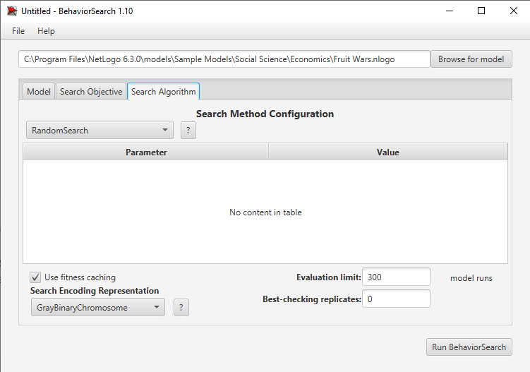
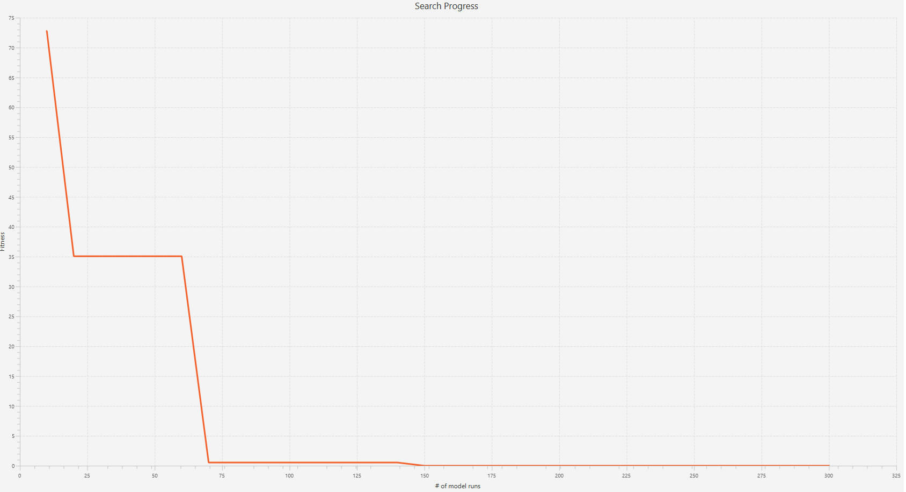

## Комп'ютерні системи імітаційного моделювання
## СПм-22-3, **Марченко Роман Михайлович**
### Лабораторна робота №**3**. Використання засобів обчислювального интелекту для оптимізації імітаційних моделей

### Варіант 13, модель у середовищі NetLogo: [Fruit Wars](https://www.netlogoweb.org/launch#http://www.netlogoweb.org/assets/modelslib/Sample%20Models/Social%20Science/Economics/Fruit%20Wars.nlogo)

### Вербальний опис моделі:
Симуляція "Fruit Wars" відображає взаємодії в економічному середовищі, де існують різні стратегії виживання та взаємодії. У цій моделі є два основних елементи: фруктові кущі (джерело енергії для збирачів) та збирачі (тварини, що збирають фрукти). Збирачі залежать від фруктів для накопичення енергії, а при досягненні певного рівня енергії вони можуть розмножуватися. Вони також вибирають різні стратегії взаємодії з іншими збирачами: співпраця, загроза, боротьба або втеча. Ця модель може бути використана для вивчення економічних теорій, таких як ненульово-сумові ігри, та аналізу поведінкових стратегій в умовах обмежених ресурсів.

### Керуючі параметри:
- **initial-fruit-bushes:** Початкова кількість фруктових кущів у моделі. 
- **initial-foragers:** Початкова кількість збирачів у моделі. 
- **ticks-to-flee:** Кількість тактів, які збирачі будуть уникати конфліктів. 
- **rate-of-mutation:** Швидкість мутацій у нащадків збирачів. 
- **collaboration-bonus:** Бонус, який отримують збирачі за співпрацю. 
- **max-age:** Максимальний вік збирачів. 
- **bush-growth-chance:** Шанс того, що фруктовий кущ відросте на конкретному такті.


### Внутрішні параметри моделі

#### Внутрішні параметри для збирачів (foragers):
- **energy**: Метаболічна енергія (Початкове значення: 100)
- **genome**: Список, що кодує успадковані параметри збирача 
- **foraging?**: Чи збирач збирає фрукти (Початкове значення: false)
- **fleeing?**: Чи збирач утікає (Початкове значення: false)
- **fleeing-turns**: Кількість ходів для утікання
- **age**: Вік збирача в тактах (Початкове значення: 0)
- **speed**: Швидкість руху
- **strength**: Сила для боротьби
- **intelligence**: Інтелект для групового збирання
- **reactive-aggression**: Ймовірність загрози
- **proactive-aggression**: Ймовірність захисту

### Внутрішні параметри для фруктових кущів (fruit-bushes):
- **amount**: Кількість енергії в кущі (Початкове значення: 500-1000, Змінюється в процесі симуляції)

### Внутрішні параметри для позначення смертей (deaths):
- **age**: Час існування знаку хреста (Змінюється)

### Показники роботи системи:
- **Population**: Поточна популяція збирачів.
- **Avg Population**: Середня популяція збирачів.
- **Murder Rate**: Відсоток вбивств від загальної кількості смертей.
- **Starvation Rate**: Відсоток смертей від голоду.
- **Old Age Rate**: Відсоток смертей від старості.
- **Reactive Aggression Level**:  Цей параметр відображає ймовірність того, що збирач зреагує агресивно, коли інший збирач наближається до нього або коли вони зустрічаються на одному фруктовому кущі. Це відповідь на безпосередню загрозу або конкуренцію за ресурси.
- **Proactive Aggression Level**: Цей параметр визначає, наскільки збирач схильний ініціювати агресію, навіть якщо прямої загрози для нього немає. Це може бути висловлено через охорону ресурсів або території, або через прагнення домінувати.    
- **Forage Rate**: Швидкість збирання.
- **Traits Over Time**: Зміни в атрибутах сили, швидкості та інтелекту збирачів у часі.

### Налаштування середовища BehaviorSearch:
Обрана модель:
C:\Program Files\NetLogo 6.3.0\models\Sample Models\Social Science\Economics\Fruit Wars.nlogo

### Параметри моделі:
Параметри та їх діапазони були автоматично вилучені середовищем BehaviorSearch із вибраної імітаційної моделі, для цього скористаємось кнопкою «Load parameter ranges from model interface»:
```
["initial-fruit-bushes" [0 1 40]]
["initial-foragers" [1 1 100]]
["bush-growth-chance" [0 1 100]]
["ticks-to-flee" [0 1 100]]
["max-age" [1 1 500]]
["collaboration-bonus" [0.1 "C" 5]]
["rate-of-mutation" [0 0.1 10]]
["show-energy?" true false]
["visualization" "None" "Reactive Aggression" "Proactive Aggression" "Strength" "Speed" "Intelligence"] 
```

### Міра фітнес-функції
В якості міри для фітнес-функції використано значення частоти вбивств збирачів в середовищі існування. Вираз цієї міри узято з налаштувань графіка імітаційної моделі в середовищі NetLogo:
```
min [ murders-rate ] of turtles
```
Скриншот панелі налаштування параметрів приведено на малюнку:


### Налаштування цільової функції (Search Objective)
Метою підбору параметрів імітаційної моделі є мінімізація значення вбивст збирачів у середовищі існування (тобто знайти такі параметри налаштуванн моделі, при яких значення числа вбивст найменше).

Ми вказуємо це за допомогою значення Minimize Fitness в параметрі "Goal". При чому, важливо, що нас має цікавити не значення популяції в окремий момент симуляції, а середнє значення протягом всієї симуляції, тривалість якої 500 кроків. Для цього в параметрі "Collected measure" вказуємо значення MEAN_ACROSS_STEPS. Щоб уникнути спотворення результатів через випадкові значення, що використовуються в логіці самої імітаційної моделі, кожна симуляція повторюється по 10 разів, результат розраховується як середнє арифметичне.

Скриншот панелі налаштування параметрів цільової функції:


### Налаштування алгоритму пошуку (Search Algorithm)
На цьому етапі було визначено модель, налаштовані її параметри, і вибрано міру ефективності, що лежить в основі функції пристосованості, що дозволяє оцінити "якість" кожного з варіанта рішення, що перевіряється BehaviorSearch. У ході дослідження будуть використовуватися два алгоритми: Випадковий пошук (RandomSearch) і Простий генетичний алгоритм (StandardGA). Для цих алгоритмів необхідно вказати "Evaluation limit" (число ітерацій пошуку, у разі GA - це буде число поколінь), та "Search Space Encoding Representation" (спосіб кодування варіанта рішення). Загальноприйнятого "кращого" способу кодування немає, неохідно визначити, які підходять для поточної моделі. Параметр "Use fitness caching" впливає тільки на продуктивність.


#### Налаштування RandomSearch алгоритму пошуку:

Результати для RandomSearch алгоритму пошуку:

``` 
Best found so far:
initial-fruit-bushes=      4
initial-foragers    =     26
bush-growth-chance  =     94
ticks-to-flee       =     81
max-age             =     19
collaboration-bonus =   1.05069
rate-of-mutation    =    0.4
show-energy?        =   true
visualization       =  Proactive Aggression

Fitness= 0.00000
```

#### Налаштування StandardGA алгоритму пошуку:

Результати для StandardGA алгоритму пошук:


```
Best found so far:
initial-fruit-bushes=      4
initial-foragers    =     26
bush-growth-chance  =     94
ticks-to-flee       =     81
max-age             =     19
collaboration-bonus =1.05069
rate-of-mutation    =    0.4
show-energy?        =   true
visualization       =Proactive Aggression

Fitness= 0.00000
```